# DAG du Pipeline Turf-Data

Diagramme genere automatiquement depuis `run_pipeline.py`.

## Statistiques

| Metrique | Valeur |
|----------|--------|
| Etapes totales | 70 |
| Dependances totales | 128 |
| Phases | 9 |

## Detail par phase

| Phase | Nom | Etapes |
|-------|-----|--------|
| 1 | Audit | 1 |
| 2 | Nettoyage | 1 |
| 3 | Deduplication | 1 |
| 4 | Comblage | 1 |
| 5 | Merges | 10 |
| 6 | Mega merge | 1 |
| 7 | Features | 53 |
| 8 | Master features | 1 |
| 9 | Quality | 1 |

## Diagramme

```mermaid
graph TD

    subgraph Phase1["Audit"]
        audit["audit"]
    end

    subgraph Phase2["Nettoyage"]
        nettoyage["nettoyage"]
    end

    subgraph Phase3["Deduplication"]
        dedup["dedup"]
    end

    subgraph Phase4["Comblage"]
        comblage["comblage"]
    end

    subgraph Phase5["Merges"]
        merge_courses_master["courses_master"]
        merge_equipements_master["equipements_master"]
        merge_marche_master["marche_master"]
        merge_meteo["meteo"]
        merge_meteo_master["meteo_master"]
        merge_pedigree_master["pedigree_master"]
        merge_performances_master["performances_master"]
        merge_rapports_21_38["rapports_21_38"]
        merge_rapports_master["rapports_master"]
        merge_stats_externes_master["stats_externes_master"]
    end

    subgraph Phase6["Mega merge"]
        mega_merge["mega_merge"]
    end

    subgraph Phase7["Features"]
        calc_41_sequences_performances["41_sequences_performances"]
        calc_42_croisement_racing_post_pmu["42_croisement_racing_post_pmu"]
        calc_43_croisement_meteo_courses["43_croisement_meteo_courses"]
        calc_44_croisement_pedigree_partants["44_croisement_pedigree_partants"]
        calc_45_graphe_relations_gnn["45_graphe_relations_gnn"]
        calc_46_track_bias_speed_class["46_track_bias_speed_class"]
        calc_48_parse_conditions_texte["48_parse_conditions_texte"]
        calc_49_ecart_cotes_internet_national["49_ecart_cotes_internet_national"]
        fb_canalturf_builder["canalturf_builder"]
        fb_cheval_features["cheval_features"]
        fb_class_change_features["class_change_features"]
        fb_combo_features["combo_features"]
        fb_course_features["course_features"]
        fb_enrichissement_builder["enrichissement_builder"]
        fb_equipement_features["equipement_features"]
        fb_field_strength_builder["field_strength_builder"]
        fb_geny_builder["geny_builder"]
        fb_interaction_features["interaction_features"]
        fb_jockey_features["jockey_features"]
        fb_marche_features["marche_features"]
        fb_meteo_features["meteo_features"]
        fb_musique_features["musique_features"]
        fb_pace_profile_builder["pace_profile_builder"]
        fb_pedigree_advanced_builder["pedigree_advanced_builder"]
        fb_pedigree_features["pedigree_features"]
        fb_perf_detaillees_builder["perf_detaillees_builder"]
        fb_poids_features["poids_features"]
        fb_precomputed_entity_joiner["precomputed_entity_joiner"]
        fb_precomputed_partant_joiner["precomputed_partant_joiner"]
        fb_profil_cheval_features["profil_cheval_features"]
        fb_racing_post_builder["racing_post_builder"]
        fb_reunions_builder["reunions_builder"]
        fb_smarkets_builder["smarkets_builder"]
        fb_temps_features["temps_features"]
        fb_track_bias_detector["track_bias_detector"]
        fb_turfostats_builder["turfostats_builder"]
        feat_cheval_distance_affinity["cheval_distance_affinity"]
        feat_cheval_hippodrome_affinity["cheval_hippodrome_affinity"]
        feat_cheval_jockey_affinity["cheval_jockey_affinity"]
        feat_cheval_terrain_affinity["cheval_terrain_affinity"]
        feat_croisements["croisements"]
        feat_entraineur_hippodrome["entraineur_hippodrome"]
        feat_field_strength["field_strength"]
        feat_historique["historique"]
        feat_interactions["interactions"]
        feat_jockey["jockey"]
        feat_jockey_entraineur_combo["jockey_entraineur_combo"]
        feat_meteo_terrain_interaction["meteo_terrain_interaction"]
        feat_pedigree["pedigree"]
        feat_pedigree_discipline_match["pedigree_discipline_match"]
        feat_sequences["sequences"]
        feat_temporel["temporel"]
        feat_value_betting["value_betting"]
    end

    subgraph Phase8["Master features"]
        master_features["master_features"]
    end

    subgraph Phase9["Quality"]
        quality["quality"]
    end

    %% Dependances
    mega_merge --> calc_41_sequences_performances
    mega_merge --> calc_42_croisement_racing_post_pmu
    mega_merge --> calc_43_croisement_meteo_courses
    mega_merge --> calc_44_croisement_pedigree_partants
    mega_merge --> calc_45_graphe_relations_gnn
    mega_merge --> calc_46_track_bias_speed_class
    mega_merge --> calc_48_parse_conditions_texte
    mega_merge --> calc_49_ecart_cotes_internet_national
    dedup --> comblage
    nettoyage --> dedup
    mega_merge --> fb_canalturf_builder
    mega_merge --> fb_cheval_features
    mega_merge --> fb_class_change_features
    mega_merge --> fb_combo_features
    mega_merge --> fb_course_features
    mega_merge --> fb_enrichissement_builder
    mega_merge --> fb_equipement_features
    mega_merge --> fb_field_strength_builder
    mega_merge --> fb_geny_builder
    mega_merge --> fb_interaction_features
    mega_merge --> fb_jockey_features
    mega_merge --> fb_marche_features
    mega_merge --> fb_meteo_features
    mega_merge --> fb_musique_features
    mega_merge --> fb_pace_profile_builder
    mega_merge --> fb_pedigree_advanced_builder
    mega_merge --> fb_pedigree_features
    mega_merge --> fb_perf_detaillees_builder
    mega_merge --> fb_poids_features
    mega_merge --> fb_precomputed_entity_joiner
    mega_merge --> fb_precomputed_partant_joiner
    mega_merge --> fb_profil_cheval_features
    mega_merge --> fb_racing_post_builder
    mega_merge --> fb_reunions_builder
    mega_merge --> fb_smarkets_builder
    mega_merge --> fb_temps_features
    mega_merge --> fb_track_bias_detector
    mega_merge --> fb_turfostats_builder
    mega_merge --> feat_cheval_distance_affinity
    mega_merge --> feat_cheval_hippodrome_affinity
    mega_merge --> feat_cheval_jockey_affinity
    mega_merge --> feat_cheval_terrain_affinity
    mega_merge --> feat_croisements
    mega_merge --> feat_entraineur_hippodrome
    mega_merge --> feat_field_strength
    mega_merge --> feat_historique
    mega_merge --> feat_interactions
    mega_merge --> feat_jockey
    mega_merge --> feat_jockey_entraineur_combo
    mega_merge --> feat_meteo_terrain_interaction
    mega_merge --> feat_pedigree
    mega_merge --> feat_pedigree_discipline_match
    mega_merge --> feat_sequences
    mega_merge --> feat_temporel
    mega_merge --> feat_value_betting
    fb_cheval_features --> master_features
    fb_course_features --> master_features
    fb_field_strength_builder --> master_features
    fb_jockey_features --> master_features
    fb_marche_features --> master_features
    fb_pace_profile_builder --> master_features
    fb_pedigree_features --> master_features
    fb_track_bias_detector --> master_features
    fb_perf_detaillees_builder --> master_features
    fb_smarkets_builder --> master_features
    fb_racing_post_builder --> master_features
    fb_reunions_builder --> master_features
    fb_enrichissement_builder --> master_features
    fb_pedigree_advanced_builder --> master_features
    fb_canalturf_builder --> master_features
    fb_turfostats_builder --> master_features
    fb_geny_builder --> master_features
    fb_musique_features --> master_features
    fb_temps_features --> master_features
    fb_profil_cheval_features --> master_features
    fb_equipement_features --> master_features
    fb_poids_features --> master_features
    fb_meteo_features --> master_features
    fb_combo_features --> master_features
    fb_class_change_features --> master_features
    fb_interaction_features --> master_features
    fb_precomputed_partant_joiner --> master_features
    fb_precomputed_entity_joiner --> master_features
    feat_croisements --> master_features
    feat_historique --> master_features
    feat_interactions --> master_features
    feat_jockey --> master_features
    feat_pedigree --> master_features
    feat_sequences --> master_features
    feat_temporel --> master_features
    feat_cheval_jockey_affinity --> master_features
    feat_cheval_hippodrome_affinity --> master_features
    feat_cheval_distance_affinity --> master_features
    feat_cheval_terrain_affinity --> master_features
    feat_jockey_entraineur_combo --> master_features
    feat_entraineur_hippodrome --> master_features
    feat_value_betting --> master_features
    feat_meteo_terrain_interaction --> master_features
    feat_pedigree_discipline_match --> master_features
    feat_field_strength --> master_features
    calc_41_sequences_performances --> master_features
    calc_42_croisement_racing_post_pmu --> master_features
    calc_43_croisement_meteo_courses --> master_features
    calc_44_croisement_pedigree_partants --> master_features
    calc_45_graphe_relations_gnn --> master_features
    calc_46_track_bias_speed_class --> master_features
    calc_48_parse_conditions_texte --> master_features
    calc_49_ecart_cotes_internet_national --> master_features
    merge_courses_master --> mega_merge
    merge_pedigree_master --> mega_merge
    merge_rapports_master --> mega_merge
    merge_meteo_master --> mega_merge
    merge_equipements_master --> mega_merge
    merge_marche_master --> mega_merge
    merge_performances_master --> mega_merge
    merge_stats_externes_master --> mega_merge
    comblage --> merge_courses_master
    comblage --> merge_equipements_master
    comblage --> merge_marche_master
    comblage --> merge_meteo
    merge_meteo --> merge_meteo_master
    comblage --> merge_pedigree_master
    comblage --> merge_performances_master
    comblage --> merge_rapports_21_38
    merge_rapports_21_38 --> merge_rapports_master
    comblage --> merge_stats_externes_master
    audit --> nettoyage
    master_features --> quality

    %% Styles par phase
    style audit fill:#e1f5fe,stroke:#0288d1
    style nettoyage fill:#f3e5f5,stroke:#7b1fa2
    style dedup fill:#e8f5e9,stroke:#388e3c
    style comblage fill:#fff3e0,stroke:#f57c00
    style merge_courses_master fill:#fce4ec,stroke:#c62828
    style merge_pedigree_master fill:#fce4ec,stroke:#c62828
    style merge_rapports_21_38 fill:#fce4ec,stroke:#c62828
    style merge_rapports_master fill:#fce4ec,stroke:#c62828
    style merge_meteo fill:#fce4ec,stroke:#c62828
    style merge_meteo_master fill:#fce4ec,stroke:#c62828
    style merge_equipements_master fill:#fce4ec,stroke:#c62828
    style merge_marche_master fill:#fce4ec,stroke:#c62828
    style merge_performances_master fill:#fce4ec,stroke:#c62828
    style merge_stats_externes_master fill:#fce4ec,stroke:#c62828
    style mega_merge fill:#e8eaf6,stroke:#283593
    style fb_cheval_features fill:#f1f8e9,stroke:#558b2f
    style fb_course_features fill:#f1f8e9,stroke:#558b2f
    style fb_field_strength_builder fill:#f1f8e9,stroke:#558b2f
    style fb_jockey_features fill:#f1f8e9,stroke:#558b2f
    style fb_marche_features fill:#f1f8e9,stroke:#558b2f
    style fb_pace_profile_builder fill:#f1f8e9,stroke:#558b2f
    style fb_pedigree_features fill:#f1f8e9,stroke:#558b2f
    style fb_track_bias_detector fill:#f1f8e9,stroke:#558b2f
    style fb_perf_detaillees_builder fill:#f1f8e9,stroke:#558b2f
    style fb_smarkets_builder fill:#f1f8e9,stroke:#558b2f
    style fb_racing_post_builder fill:#f1f8e9,stroke:#558b2f
    style fb_reunions_builder fill:#f1f8e9,stroke:#558b2f
    style fb_enrichissement_builder fill:#f1f8e9,stroke:#558b2f
    style fb_pedigree_advanced_builder fill:#f1f8e9,stroke:#558b2f
    style fb_canalturf_builder fill:#f1f8e9,stroke:#558b2f
    style fb_turfostats_builder fill:#f1f8e9,stroke:#558b2f
    style fb_geny_builder fill:#f1f8e9,stroke:#558b2f
    style fb_musique_features fill:#f1f8e9,stroke:#558b2f
    style fb_temps_features fill:#f1f8e9,stroke:#558b2f
    style fb_profil_cheval_features fill:#f1f8e9,stroke:#558b2f
    style fb_equipement_features fill:#f1f8e9,stroke:#558b2f
    style fb_poids_features fill:#f1f8e9,stroke:#558b2f
    style fb_meteo_features fill:#f1f8e9,stroke:#558b2f
    style fb_combo_features fill:#f1f8e9,stroke:#558b2f
    style fb_class_change_features fill:#f1f8e9,stroke:#558b2f
    style fb_interaction_features fill:#f1f8e9,stroke:#558b2f
    style fb_precomputed_partant_joiner fill:#f1f8e9,stroke:#558b2f
    style fb_precomputed_entity_joiner fill:#f1f8e9,stroke:#558b2f
    style feat_croisements fill:#f1f8e9,stroke:#558b2f
    style feat_historique fill:#f1f8e9,stroke:#558b2f
    style feat_interactions fill:#f1f8e9,stroke:#558b2f
    style feat_jockey fill:#f1f8e9,stroke:#558b2f
    style feat_pedigree fill:#f1f8e9,stroke:#558b2f
    style feat_sequences fill:#f1f8e9,stroke:#558b2f
    style feat_temporel fill:#f1f8e9,stroke:#558b2f
    style feat_cheval_jockey_affinity fill:#f1f8e9,stroke:#558b2f
    style feat_cheval_hippodrome_affinity fill:#f1f8e9,stroke:#558b2f
    style feat_cheval_distance_affinity fill:#f1f8e9,stroke:#558b2f
    style feat_cheval_terrain_affinity fill:#f1f8e9,stroke:#558b2f
    style feat_jockey_entraineur_combo fill:#f1f8e9,stroke:#558b2f
    style feat_entraineur_hippodrome fill:#f1f8e9,stroke:#558b2f
    style feat_value_betting fill:#f1f8e9,stroke:#558b2f
    style feat_meteo_terrain_interaction fill:#f1f8e9,stroke:#558b2f
    style feat_pedigree_discipline_match fill:#f1f8e9,stroke:#558b2f
    style feat_field_strength fill:#f1f8e9,stroke:#558b2f
    style calc_41_sequences_performances fill:#f1f8e9,stroke:#558b2f
    style calc_42_croisement_racing_post_pmu fill:#f1f8e9,stroke:#558b2f
    style calc_43_croisement_meteo_courses fill:#f1f8e9,stroke:#558b2f
    style calc_44_croisement_pedigree_partants fill:#f1f8e9,stroke:#558b2f
    style calc_45_graphe_relations_gnn fill:#f1f8e9,stroke:#558b2f
    style calc_46_track_bias_speed_class fill:#f1f8e9,stroke:#558b2f
    style calc_48_parse_conditions_texte fill:#f1f8e9,stroke:#558b2f
    style calc_49_ecart_cotes_internet_national fill:#f1f8e9,stroke:#558b2f
    style master_features fill:#fff8e1,stroke:#ff8f00
    style quality fill:#efebe9,stroke:#4e342e
```

## Liste des etapes

### Phase 1 : Audit

| Etape | Script | Dependances |
|-------|--------|-------------|
| audit | `audit_data_integrity.py` | - |

### Phase 2 : Nettoyage

| Etape | Script | Dependances |
|-------|--------|-------------|
| nettoyage | `nettoyage_global.py` | audit |

### Phase 3 : Deduplication

| Etape | Script | Dependances |
|-------|--------|-------------|
| dedup | `deduplication.py` | nettoyage |

### Phase 4 : Comblage

| Etape | Script | Dependances |
|-------|--------|-------------|
| comblage | `comblage_trous.py` | dedup |

### Phase 5 : Merges

| Etape | Script | Dependances |
|-------|--------|-------------|
| merge_courses_master | `merge_02_02b_courses_master.py` | comblage |
| merge_equipements_master | `merge_equipements_master.py` | comblage |
| merge_marche_master | `merge_marche_master.py` | comblage |
| merge_meteo | `merge_meteo.py` | comblage |
| merge_meteo_master | `merge_meteo_master.py` | merge_meteo |
| merge_pedigree_master | `merge_pedigree_master.py` | comblage |
| merge_performances_master | `merge_performances_master.py` | comblage |
| merge_rapports_21_38 | `merge_rapports_21_38.py` | comblage |
| merge_rapports_master | `merge_rapports_master.py` | merge_rapports_21_38 |
| merge_stats_externes_master | `merge_stats_externes_master.py` | comblage |

### Phase 6 : Mega merge

| Etape | Script | Dependances |
|-------|--------|-------------|
| mega_merge | `mega_merge_partants_master.py` | merge_courses_master, merge_pedigree_master, merge_rapports_master, merge_meteo_master, merge_equipements_master, merge_marche_master, merge_performances_master, merge_stats_externes_master |

### Phase 7 : Features

| Etape | Script | Dependances |
|-------|--------|-------------|
| calc_41_sequences_performances | `41_sequences_performances.py` | mega_merge |
| calc_42_croisement_racing_post_pmu | `42_croisement_racing_post_pmu.py` | mega_merge |
| calc_43_croisement_meteo_courses | `43_croisement_meteo_courses.py` | mega_merge |
| calc_44_croisement_pedigree_partants | `44_croisement_pedigree_partants.py` | mega_merge |
| calc_45_graphe_relations_gnn | `45_graphe_relations_gnn.py` | mega_merge |
| calc_46_track_bias_speed_class | `46_track_bias_speed_class.py` | mega_merge |
| calc_48_parse_conditions_texte | `48_parse_conditions_texte.py` | mega_merge |
| calc_49_ecart_cotes_internet_national | `49_ecart_cotes_internet_national.py` | mega_merge |
| fb_canalturf_builder | `feature_builders/canalturf_builder.py` | mega_merge |
| fb_cheval_features | `feature_builders/cheval_features.py` | mega_merge |
| fb_class_change_features | `feature_builders/class_change_features.py` | mega_merge |
| fb_combo_features | `feature_builders/combo_features.py` | mega_merge |
| fb_course_features | `feature_builders/course_features.py` | mega_merge |
| fb_enrichissement_builder | `feature_builders/enrichissement_builder.py` | mega_merge |
| fb_equipement_features | `feature_builders/equipement_features.py` | mega_merge |
| fb_field_strength_builder | `feature_builders/field_strength_builder.py` | mega_merge |
| fb_geny_builder | `feature_builders/geny_builder.py` | mega_merge |
| fb_interaction_features | `feature_builders/interaction_features.py` | mega_merge |
| fb_jockey_features | `feature_builders/jockey_features.py` | mega_merge |
| fb_marche_features | `feature_builders/marche_features.py` | mega_merge |
| fb_meteo_features | `feature_builders/meteo_features.py` | mega_merge |
| fb_musique_features | `feature_builders/musique_features.py` | mega_merge |
| fb_pace_profile_builder | `feature_builders/pace_profile_builder.py` | mega_merge |
| fb_pedigree_advanced_builder | `feature_builders/pedigree_advanced_builder.py` | mega_merge |
| fb_pedigree_features | `feature_builders/pedigree_features.py` | mega_merge |
| fb_perf_detaillees_builder | `feature_builders/perf_detaillees_builder.py` | mega_merge |
| fb_poids_features | `feature_builders/poids_features.py` | mega_merge |
| fb_precomputed_entity_joiner | `feature_builders/precomputed_entity_joiner.py` | mega_merge |
| fb_precomputed_partant_joiner | `feature_builders/precomputed_partant_joiner.py` | mega_merge |
| fb_profil_cheval_features | `feature_builders/profil_cheval_features.py` | mega_merge |
| fb_racing_post_builder | `feature_builders/racing_post_builder.py` | mega_merge |
| fb_reunions_builder | `feature_builders/reunions_builder.py` | mega_merge |
| fb_smarkets_builder | `feature_builders/smarkets_builder.py` | mega_merge |
| fb_temps_features | `feature_builders/temps_features.py` | mega_merge |
| fb_track_bias_detector | `feature_builders/track_bias_detector.py` | mega_merge |
| fb_turfostats_builder | `feature_builders/turfostats_builder.py` | mega_merge |
| feat_cheval_distance_affinity | `feat_cheval_distance_affinity.py` | mega_merge |
| feat_cheval_hippodrome_affinity | `feat_cheval_hippodrome_affinity.py` | mega_merge |
| feat_cheval_jockey_affinity | `feat_cheval_jockey_affinity.py` | mega_merge |
| feat_cheval_terrain_affinity | `feat_cheval_terrain_affinity.py` | mega_merge |
| feat_croisements | `feat_croisements.py` | mega_merge |
| feat_entraineur_hippodrome | `feat_entraineur_hippodrome.py` | mega_merge |
| feat_field_strength | `feat_field_strength.py` | mega_merge |
| feat_historique | `feat_historique.py` | mega_merge |
| feat_interactions | `feat_interactions.py` | mega_merge |
| feat_jockey | `feat_jockey.py` | mega_merge |
| feat_jockey_entraineur_combo | `feat_jockey_entraineur_combo.py` | mega_merge |
| feat_meteo_terrain_interaction | `feat_meteo_terrain_interaction.py` | mega_merge |
| feat_pedigree | `feat_pedigree.py` | mega_merge |
| feat_pedigree_discipline_match | `feat_pedigree_discipline_match.py` | mega_merge |
| feat_sequences | `feat_sequences.py` | mega_merge |
| feat_temporel | `feat_temporel.py` | mega_merge |
| feat_value_betting | `feat_value_betting.py` | mega_merge |

### Phase 8 : Master features

| Etape | Script | Dependances |
|-------|--------|-------------|
| master_features | `master_feature_builder.py` | fb_cheval_features, fb_course_features, fb_field_strength_builder, fb_jockey_features, fb_marche_features, fb_pace_profile_builder, fb_pedigree_features, fb_track_bias_detector, fb_perf_detaillees_builder, fb_smarkets_builder, fb_racing_post_builder, fb_reunions_builder, fb_enrichissement_builder, fb_pedigree_advanced_builder, fb_canalturf_builder, fb_turfostats_builder, fb_geny_builder, fb_musique_features, fb_temps_features, fb_profil_cheval_features, fb_equipement_features, fb_poids_features, fb_meteo_features, fb_combo_features, fb_class_change_features, fb_interaction_features, fb_precomputed_partant_joiner, fb_precomputed_entity_joiner, feat_croisements, feat_historique, feat_interactions, feat_jockey, feat_pedigree, feat_sequences, feat_temporel, feat_cheval_jockey_affinity, feat_cheval_hippodrome_affinity, feat_cheval_distance_affinity, feat_cheval_terrain_affinity, feat_jockey_entraineur_combo, feat_entraineur_hippodrome, feat_value_betting, feat_meteo_terrain_interaction, feat_pedigree_discipline_match, feat_field_strength, calc_41_sequences_performances, calc_42_croisement_racing_post_pmu, calc_43_croisement_meteo_courses, calc_44_croisement_pedigree_partants, calc_45_graphe_relations_gnn, calc_46_track_bias_speed_class, calc_48_parse_conditions_texte, calc_49_ecart_cotes_internet_national |

### Phase 9 : Quality

| Etape | Script | Dependances |
|-------|--------|-------------|
| quality | `quality/run_all_tests.py` | master_features |
