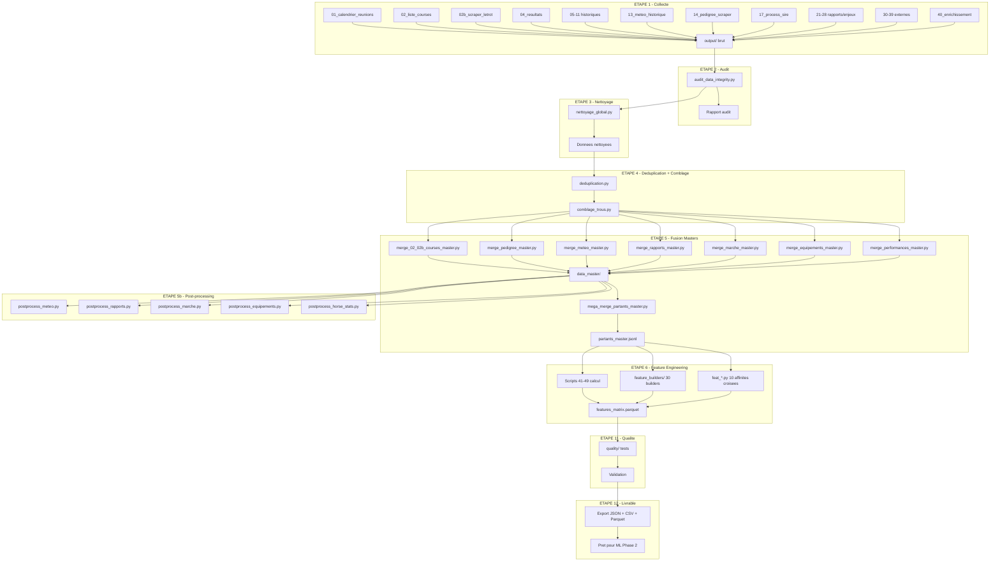
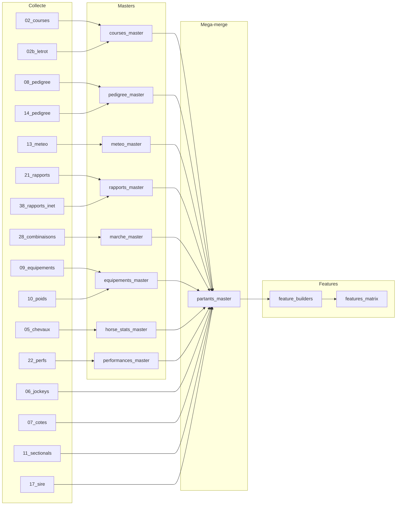

# Pipeline d'execution

Ordre d'execution complet du pipeline de donnees hippiques, de la collecte brute au livrable final.

---

## Diagramme global



---

## Ordre d'execution detaille

### Phase 1 : Collecte (scripts 00-40)

Les scripts de collecte sont independants et peuvent tourner en parallele. Chacun ecrit dans son sous-dossier `output/XX_*/`.

```
# Lancer les collecteurs (en parallele si possible)
python 01_calendrier_reunions.py --date-debut 2013-01-01 --date-fin 2026-03-18
python 02_liste_courses.py
python 02b_scraper_letrot.py
python 04_resultats.py
python 05_historique_chevaux.py
python 06_historique_jockeys.py
python 07_cotes_marche.py
python 08_pedigree.py
python 09_equipements.py
python 10_poids_handicaps.py
python 11_sectionals.py
python 13_meteo_historique.py
python 14_pedigree_scraper.py
python 17_process_sire.py
python 21_rapports_definitifs.py
python 22_performances_detaillees.py
python 23_pronostics_equidia.py
python 24_canalturf_scraper.py
python 25_turfostats_scraper.py
python 26_geny_scraper.py
python 27_citations_enjeux.py
python 28_combinaisons_marche.py
python 30_smarkets_exchange.py
python 37_rpscrape_racing_post.py
python 38_rapports_internet.py
python 39_reunions_enrichies.py
python 40_enrichissement_partants.py
```

Tous les scripts ont des checkpoints et reprennent automatiquement apres un crash.

### Phase 2 : Audit

```
python audit_data_integrity.py
```

Verifie : JSON valides, 0-bytes, doublons, plages de dates, outliers, taux de remplissage.

### Phase 3 : Nettoyage

```
python nettoyage_global.py
```

Corrige : UTF-8, normalisation noms, formats date ISO 8601, valeurs null coherentes.

### Phase 4 : Deduplication + Comblage

```
python deduplication.py
python comblage_trous.py
```

Deduplication entre sources (02/02b, 08/12/14/36, 21/38). Comblage depuis sources croisees.

### Phase 5 : Fusion en Masters

Ordre de fusion (les merges par domaine sont independants) :

```
# Merges par domaine (en parallele)
python merge_02_02b_courses_master.py      # -> courses_master.jsonl
python merge_pedigree_master.py            # -> pedigree_master.json
python merge_meteo_master.py               # -> meteo_master.json
python merge_rapports_21_38.py             # -> rapports_master.json
python merge_marche_master.py              # -> marche_master.json
python merge_equipements_master.py         # -> equipements_master.json
python merge_performances_master.py        # -> performances_master.json
python merge_stats_externes_master.py      # -> stats_externes_master.json

# Post-processing des masters (en parallele)
python postprocess_meteo.py
python postprocess_rapports.py
python postprocess_marche.py
python postprocess_equipements.py
python postprocess_horse_stats.py

# Mega-merge final (depend de tous les masters)
python mega_merge_partants_master.py       # -> partants_master.jsonl
```

### Phase 6 : Feature Engineering

```
# Scripts de calcul (en parallele, chacun lit partants_master)
python 41_sequences_performances.py
python 42_croisement_racing_post_pmu.py
python 43_croisement_meteo_courses.py
python 44_croisement_pedigree_partants.py
python 45_graphe_relations_gnn.py
python 46_track_bias_speed_class.py
python 48_parse_conditions_texte.py
python 49_ecart_cotes_internet_national.py

# Feature builders avances (en parallele)
python feat_historique.py
python feat_croisements.py
python feat_jockey.py
python feat_interactions.py
python feat_pedigree.py
python feat_temporel.py
python feat_sequences.py

# Affinites croisees (en parallele)
python feat_cheval_jockey_affinity.py
python feat_cheval_hippodrome_affinity.py
python feat_cheval_distance_affinity.py
python feat_cheval_terrain_affinity.py
python feat_jockey_entraineur_combo.py
python feat_entraineur_hippodrome.py
python feat_value_betting.py
python feat_meteo_terrain_interaction.py
python feat_pedigree_discipline_match.py
python feat_field_strength.py

# Assemblage final de la matrice
python feature_builders/master_feature_builder.py
```

### Phase 7 : Qualite

```
python quality/test_json_integrity.py
python quality/test_zero_bytes.py
python quality/test_record_counts.py
python quality/test_features_quality.py
python quality/leakage_detector.py
```

### Phase 8 : Export

```
# Triple format : JSON + CSV + Parquet
# Export final de features_matrix, labels, et tous les masters
```

---

## Dependances entre scripts



---

## Temps d'execution estimes

| Phase | Duree estimee | RAM requise | Notes |
|-------|--------------|-------------|-------|
| Collecte complete | ~50h (parallele ~15h) | ~15 MB/script | Checkpoint/resume |
| Audit | ~30 min | ~4 GB | Lecture sequentielle |
| Nettoyage | ~1h | ~8 GB | Streaming JSONL |
| Deduplication | ~2h | ~16 GB | Index en memoire |
| Comblage | ~1h | ~8 GB | Lookups croises |
| Fusion masters | ~2h | ~16-32 GB | Merges par domaine |
| Mega-merge | ~3h | ~32-64 GB | Jointure de tous les masters |
| Feature engineering | ~4h | ~32 GB | Calcul rolling windows |
| Qualite | ~30 min | ~4 GB | Tests automatiques |
| Export | ~1h | ~16 GB | Triple format |
| **TOTAL** | **~12-15h** | **64 GB recommande** | |

---

## 16 Phases du systeme complet (modules 1-68)

Le systeme complet (data + modeles) est organise en 16 phases dans `pipeline/` :

| Phase | Nom | Modules | Description |
|-------|-----|---------|-------------|
| 01 | Infrastructure | 1-8 | Ingestion, schema, dataset builder, qualite, missing values, outliers, normalizer, cache |
| 02 | Feature Engineering | 9-18 | Features avancees, rolling stats, temporal, odds, synergy, pedigree, track bias, pace, sectional, field strength |
| 03 | Feature Selection | 19-20 | Selection automatique, optimisation subsets |
| 04 | ML Core | 21-25 | Logistic Regression, Random Forest, XGBoost, LightGBM, CatBoost |
| 05 | Deep Learning | 26-30 | MLP, LSTM, GRU, TabNet, TFT |
| 06 | Advanced | 31-34 | GNN, Bayesian NN, Survival Model, Quantile Regressor |
| 07 | AutoML | 35-37 | AutoGluon, TPOT, H2O |
| 08 | Fusion | 38-40 | Stacking, Blending, Meta-model |
| 09 | Calibration | 41-43 | Calibration des probabilites |
| 10 | Outsiders | 44-46 | Anomaly Detector, Retour Forme Hidden, GAN Turf |
| 11 | Betting | 47-50 | ROI Predictor, Value Hunter RL, Meta Selector, ZURI |
| 12 | Simulation | 51-52 | Monte Carlo, Race Simulation Engine |
| 13 | Bet Sizing | 53-57 | Kelly, Sizing, Tickets |
| 14 | Adaptation | 58-60 | Recalibration, Decay Detector, Drift Detector |
| 15 | Monitoring | 61-63 | Monitoring, Dashboard, Alerts |
| 16 | Orchestration | 64-68 | Pipeline, Scheduler, Controller |
